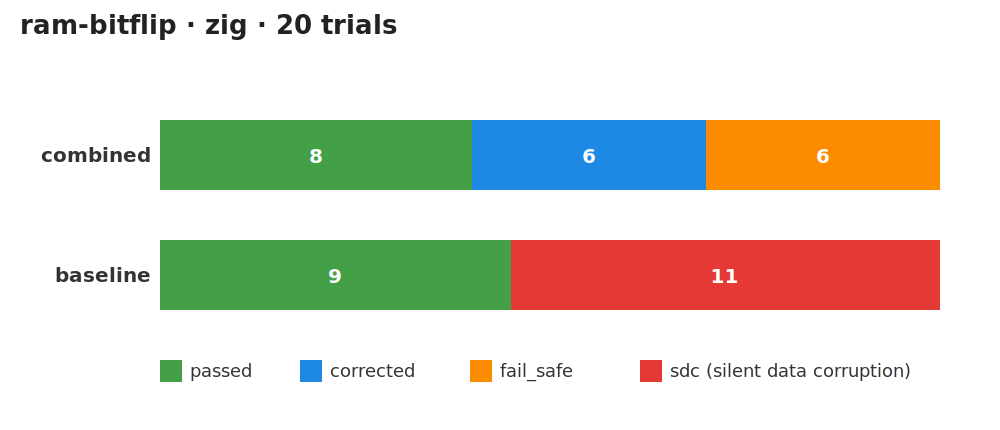

# Fault Tolerance: C vs Zig

Comparing software fault-tolerance techniques across two systems languages,
evaluated by **fault injection** on bare-metal Cortex-M4 under QEMU.

Repo: `github.com/b-kaf/fault-tolerance-comparison`

---

## Techniques compared

| Technique | Idea |
| --- | --- |
| **TMR** | Triple-modular redundancy + majority vote |
| **Checkpointing** | Snapshot known-good state, restart on corruption |
| **Recovery blocks** | Primary → acceptance test → alternate |
| **Control-flow monitoring** | Software signatures guard phase transitions |

Each is implemented **twice** — once in C (`c/`), once in Zig (`zig/`).

---

## Repo structure

```
 c/  zig/        firmware logic (the techniques)
   │
 harness/        bare-metal Cortex-M4 ELFs (built by build.zig)
   ├─ e2e/       GDB-driven, deterministic injection
   └─ fuzz/      single-shot, plugin-driven injection
   │
 harness/tui/    one Go binary: runner + interactive TUI
   │
 QEMU mps2-an386 + qemu-ft-fuzz TCG plugin
```

---

## Harness runner (Go TUI)

- Single Go binary (`harness/tui`) — interactive TUI **and** headless CLI.
- Drives campaigns, classifies every trial, writes CSV.

```sh
harness-tui e2e  --technique tmr --language zig --iterations 20
harness-tui fuzz --technique combined --language c --campaign ram-bitflip
```

Outcomes per trial: `masked` · `corrected` · `detected` · `fail_safe`
· `sdc` · `crash` · `hang`.

---

## How e2e runs

Deterministic, GDB-driven injection — one fault per loop iteration.
Mostly used to validate that a technique implementation is sound.

1. Launch QEMU paused waiting for debugger, attach **GDB/MI** over the RSP endpoint.
2. Breakpoint at the firmware's exported **injection hooks**.
3. At the hook, write the fault-control globals
   (`harness_fault_target`, `harness_fault_value`).
4. Continue; read back the result counters (`harness_passes`,
   `harness_failures`, status symbols).

Exit codes: `0` clean · `1` campaign saw failures · `2` usage/run error.

---

## Fuzzing: one fault per trial

- A campaign spawns multiple trials from a single **campaign seed**
- Per-trial **trial seed** = `BLAKE2b(campaign_seed, trial_id, technique,
  language, campaign)` — written into the firmware (`harness_trial_seed`) and
  used to seed the plugin's RNG.
- The trial seed decides **what** the fault hits (register, bit, RAM symbol,
  offset).
- All errors are injected between a predetermined fault window (marked by `harness_fault_window_open`/ `harness_fault_window_close`).

**Deterministic:** same campaign seed + trial index → the exact same
fault. Any campaign/trial is reproducible in isolation.

---

## Fuzz campaign — `reg-bitflip`

- The plugin flips **one random bit
  in a general-purpose register** after a deterministic jitter.
- Models a transient SEU striking the CPU register file mid-computation.
- Stresses logic that assumes register values stay intact across a computation
  (TMR copies, recovery-block intermediates).

---

## Fuzz campaign — `ram-bitflip`

- Picks one of the firmware's exported `harness_fuzz_*` **live-state symbols**
  and flips a random bit in it.
- Models a transient bit flip in **data memory** (stored state, checkpoints).
- Targets what checkpointing and acceptance tests are meant to catch:
  corrupted stored values, lengths, and checksums.

---

## Fuzz campaign — `insn-skip`

- Removes a single instruction from the stream by **advancing the PC past it**
  (skips the instruction after a random offset into the fault window).
- Models a dropped/skipped instruction — a control-flow fault.
- Trials run with `-accel tcg,one-insn-per-tb=on` so a mid-block PC write
  removes **exactly one** instruction (scoped to this campaign; slower).
- This is what control-flow signature monitoring is designed to detect.

> A `none` campaign runs the same firmware with **no** fault — the clean-run control.

---

## Combined vs baseline harnesses

Same workload, same faults — one protected by all techniques, one with none.

| Phase | `combined` | `baseline` |
| --- | --- | --- |
| read | TMR vote | plain read |
| compute | recovery block | single compute |
| commit | checkpoint commit-or-restart | plain assignment |
| whole run | control-flow monitor | — |

---

## Sample campaign results — `ram-bitflip`



**Same fault model, opposite outcome:** `combined` corrects or fail-safes every
fault it doesn't simply mask → **0 SDC**. `baseline` silently corrupts on
**11 of 20** trials.
